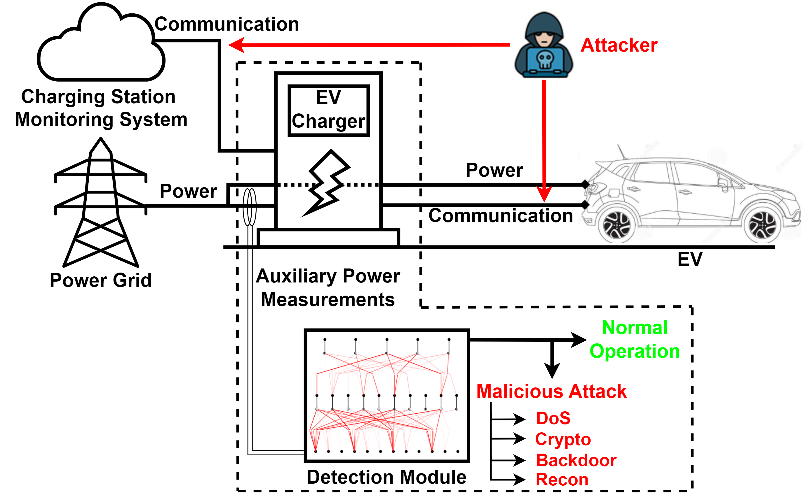
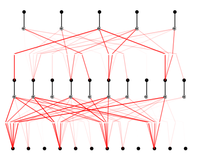

# Multiclass KAN - EVSE Cyberattacks

**Paper:** Interpretable Cyberattack Detection and Classification for Electric Vehicle Charging: A Multiclass Kolmogorov-Arnold Network Framework

## Overview
This repository contains the code and resources for a [Kolmogorov-Arnold Network](https://github.com/KindXiaoming/pykan/tree/master) (KAN)-based framework for detecting and classifying cyberattacks on Electric Vehicle Supply Equipment (EVSE) using only local auxiliary power consumption measurements (voltage, current, and power). The model classifies five cyberattack scenarios based on the [CICEVSE 2024 dataset](https://www.unb.ca/cic/datasets/evse-dataset-2024.html): normal EVSE operation, denial-of-service, cryptojacking, backdoor, and reconnaissance attacks.



**KAN architecture for multiclass attack detection module:**



## Setup
**Prerequisites:**
```
python 3.11.9
pip
```

**Requirements:** 
```
kan==0.0.2
numpy==1.25.2
pykan==0.2.8
scikit_learn==1.8.0
seaborn==0.13.2
torch==2.7.0+cu118
tsai==0.4.1
bayesian-optimization==1.5.0
```

1. **Clone the repository**
```bash
git clone https://github.com/Jefflie/ev-charging.git
cd ev-charging
```

2. **Set up the virtual environment**
Using `venv` virtual environment to install the required packages:
```bash
python -m venv .venv
.venv\Scripts\activate
```

3. **Install the required packages**
```
pip install -r requirements.txt
```

4. **Preprocess the dataset**
```bash
cd data
python data_preprocessing.py
```

5. **Training and experiments**
Scripts for training, pruning, symbolic formula extraction, and testing can be found in the [multiclass_classification.ipynb](https://github.com/Jefflie/ev-charging/blob/main/src/multiclass_classification.ipynb) notebook.

## Dataset
This project uses the **CICEVSE 2024** dataset, which contains 115,298 samples of EVSE power consumption measurements (shunt voltage, bus voltage, current, and power) recorded at 1 sample/second under both normal and attack conditions.

**Download:** [CICEVSE 2024 Dataset](https://www.unb.ca/cic/datasets/)

A copy of the power consumption measurement dataset can be found at [EVSE-B-PowerCombined.csv](https://github.com/Jefflie/ev-charging/blob/main/data/EVSE-B-PowerCombined.csv) along with its readme [CICEVSE2024_readme.txt](https://github.com/Jefflie/ev-charging/blob/main/data/CICEVSE2024_readme.txt).

Before using the data as input to the KAN model, we aggregate the four power measurements using an n-sample sliding time window with stride length 1 to extract three time-series features for each measurement: mean, variance, and range; for a total of **12 input features**. The datasets with these features are extracted using `data/data_preprocessing.py`, and the datasets themselves can be found at `data/merged1_train.csv` and `data/merged1_test.csv`.

## Citation

```bibtex
Coming soon
```
